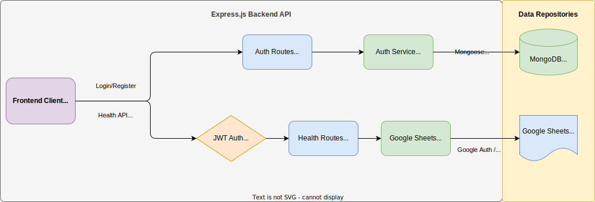

# Health Tracker WebApp

A Full-stack wellness tracking application featuring a React/Vite interactive dashboard and a Node/Express backend that securely saves structured health data directly to Google Sheets.

---

## Project Phases Completed

### Phase 1: Project Skeleton

- Initialized a Node.js project.
- Installed base dependencies (`express`, `cors`, `dotenv`, `typescript`, `tsx`).
- Created the foundational directory structure (`src/`, `types/`, `routes/`, `services/`, `middleware/`).
- Set up `package.json` scripts including a `dev` command using `tsx`.
- Implemented a basic root `GET /` endpoint to verify the server is running.

### Phase 2: API Architecture (The "API Layer")

- Defined strict TypeScript Type Definitions (Interfaces and Enums) for `HealthLog`, `ParameterType` (Weight, Blood Pressure, Heart Rate).
- Created a dedicated `healthRoutes.ts` to manage endpoints cleanly.
- Implemented the `POST /health-log` route to handle incoming structured data.
- Implemented the `GET /health-log` route to retrieve stored data.

### Phase 3: Logic & Validation

- Installed **Zod** for robust payload validation.
- Defined explicit Zod schemas tailored for `WEIGHT`, `BLOOD_PRESSURE`, and `HEART_RATE` (e.g., ensuring positive values, valid ISO timestamps).
- Implemented a reusable `validate.ts` middleware that intercepts requests and sends clean JSON errors (400 Bad Request) before hitting the endpoint logic.
- Implemented a global `errorHandler.ts` middleware to ensure errors never crash the app or expose internal stack traces.

### Phase 4: Persistence Layer (Google Sheets Integration)

- Set up a Google Cloud Service Account and generated JSON credentials.
- Connected the `googleapis` library.
- Developed a `GoogleSheetsService` class that securely targets a specific Google Sheet using environment variables (`GOOGLE_SHEET_ID`, `GOOGLE_SERVICE_ACCOUNT_KEY`).
- Updated the `POST /health-log` endpoint to replace the local memory array with the `appendLog()` method—directly storing validated health metrics into the Google Sheet as rows.

### Phase 5: Postman Readiness

- Configured a Postman `LocalDev` Environment to manage URLs (`{{base_url}}`).
- Successfully constructed and saved a `POST` Request Collection for easy, repeatable testing against `http://localhost:3000/health-log`.
- Triggered sample JSON payloads verifying the entire stack: Request → Validation → Storage (Google Sheets) → `201 Created` Response.

### Phase 6: Frontend & Fullstack Restructure

- **Monorepo Setup**: Restructured the project into a comprehensive monorepo layout hosting both the `client/` (React/Vite) and `server/` (Node/Express).
- **Concurrent Launcher**: Configured a new root workspace to run both backend and frontend servers simultaneously using `npm run dev`.
- **Interactive UI**: Developed a custom, animated dashboard design featuring dynamic log filtering, history lists, and real-time form validations.
- **Data Visualization**: Integrated `recharts` to render informative, real-time trend charts for Weight, Blood Pressure, and Heart Rate.

## Architecture Diagram

